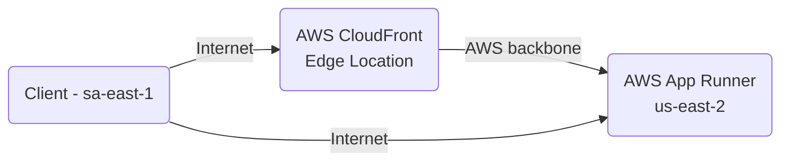

# AWS CloudFront latency

Comparing latency when using AWS CloudFront at long distances as opposed to calling a web service directly.

> Cache is disabled to to force round trips to the server




## Setup

This project runs my [stressbox][1] image for testing as default. 

Create a private ECR:

```sh
aws ecr create-repository --repository-name stressbox
```

Pull the image and tag it with the repository name in the account:

```sh
docker pull ghcr.io/epomatti/stressbox
docker tag ghcr.io/epomatti/stressbox "$account.dkr.ecr.$region.amazonaws.com/stressbox"
```

Push the image to the account repository:

```sh
aws ecr get-login-password --region $region | docker login --username AWS --password-stdin $account.dkr.ecr.$region.amazonaws.com
docker push $account.dkr.ecr.$region.amazonaws.com/stressbox
```

Create a `.auto.tfvars` file with the ECR image URL:

```terraform
ecr_image = "<ACCOUNT>.dkr.ecr.<REGION>.amazonaws.com/stressbox:latest"
```

Create the infrastructure:

```sh
terraform init
terraform apply -auto-approve
```

Run latency and access tests.

---

### Clean-up

Delete the resources:

```sh
terraform destroy -auto-approve

aws ecr delete-repository --repository-name stressbox
```


[1]: https://github.com/epomatti/stressbox
